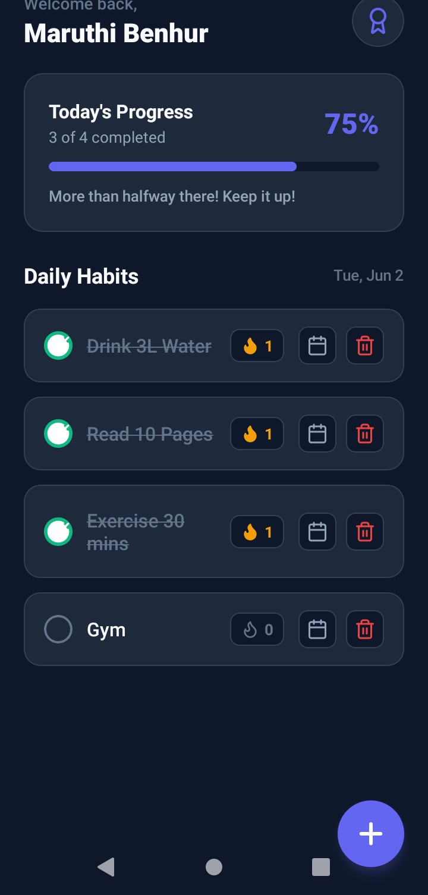
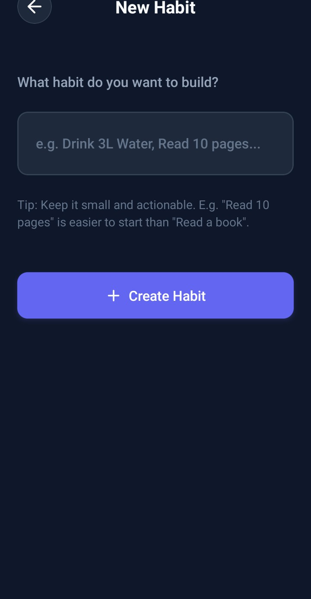
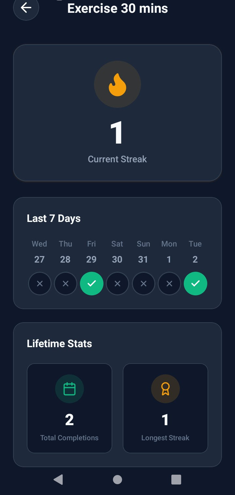

# Habit Tracker Mobile App ⚡

A beautiful, offline-first mobile application built with **React Native** and **Expo** that helps users form habits, maintain daily routines, and track streaks. Featuring elegant dark-mode glassmorphism, responsive spring animations, and local persistence.

---

## 📸 App Preview

<p align="center">
  
  
  
</p>

---

## ✨ Features

- 🎯 **Daily Habit Tracking**: Easily view, check off, and manage your daily routines.
- ➿ **Streak System**: Smart streak logic that rewards consistency.
  - **Active Streak**: Accumulates daily as you check off habits.
  - **Pending Streak**: Maintains your current streak count today until the day ends.
  - **Broken Streak**: Resets to 0 if a habit is missed for more than a day.
- 📊 **Progress Dashboard**: Interactive progress ring and cards showing your daily completion percentage.
- 📅 **Detailed History**: Log calendar view to inspect past completions and track consistency over time.
- 🎨 **Premium UI/UX**: Built with a sleek Slate 900 dark theme, custom spring micro-animations, and clean typography.
- 💾 **Local Persistence**: Offline-first storage using `@react-native-async-storage/async-storage` for seamless instant loads.

---

## 🛠️ Tech Stack

- **Framework**: [Expo](https://expo.dev) (v56) with React Native
- **Routing**: [Expo Router](https://docs.expo.dev/router/introduction/) (File-based navigation)
- **Icons**: `lucide-react-native`
- **Animations**: React Native Animated (Spring physics)
- **Storage**: AsyncStorage (Offline-first data caching)

---

## 🚀 Getting Started

### 📋 Prerequisites

Make sure you have Node.js installed on your development machine.

### ⚙️ Installation

1. **Clone the repository**:
   ```bash
   git clone https://github.com/Benhur167/Habit_Tracker.git
   cd Habit_Tracker
   ```

2. **Install dependencies**:
   ```bash
   npm install
   ```

3. **Start the development server**:
   ```bash
   npm run start
   ```

### 📱 Running the App

Once the development server is running, you can open the app on:
- **Android Emulator**: Press `a` in the terminal.
- **iOS Simulator**: Press `i` in the terminal.
- **Expo Go (Physical Device)**: Scan the QR code using the Expo Go app (Android) or Camera app (iOS).
- **Web Browser**: Run `npm run web` to start the web version.

